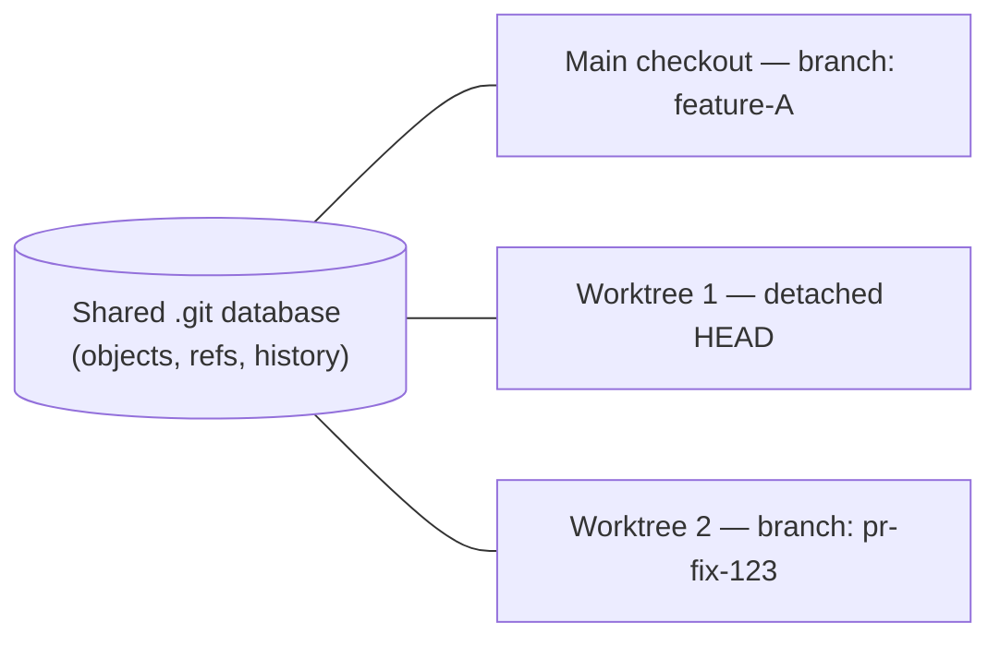
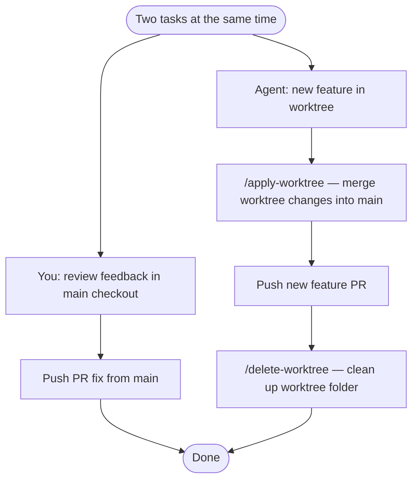
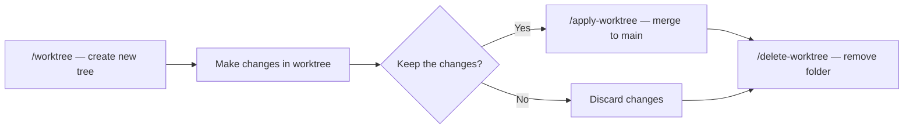

# Cursor Worktree — A Beginner’s Guide

This page explains **Cursor Worktree** in plain language. You do not need to be a Git expert to follow along.

---

## 1. The problem (why this exists)

Imagine **one desk** and **many helpers** (AI tools, agents, or even you switching tasks). Everyone wants to change the **same papers** at the **same time**.

- People **step on each other’s edits** (file clashes).
- Or work has to happen **one after another** (slow).

That is the problem: **one branch, one folder, many parallel jobs** = messy or slow.

---

## 2. The idea in one line

**Cursor Worktree** gives you a **second workspace** for the *same* repository, so one helper can work “over there” while you or another helper work “over here,” **without** performing a full additional clone of the repository.

---

## 3. What it is really built on (Git worktree)

**Git worktree** means:

- It is still **one Git repository** (one shared “memory” of history).
- You get an **extra folder** on your computer with its **own copy of the files** checked out.
- You can be on a **branch** *or* a **detached HEAD** (a fixed snapshot in time, like a bookmark to one commit), depending on how the worktree was created.

**Analogy:** One library owns all the **books** (the Git data). You do not duplicate the entire library; you simply open a **second reading table** (second folder) that uses the same collection, with a **different** book *open* to a specific page. Same collection; two places to read and write.

**Why it is lighter than a full clone:** The shared part of the repository (Git objects) is **not** duplicated the way a full `git clone` would do it. A new folder is added; Git ties it to the same repository.

**Diagram — one repository, multiple checkouts:**



---

## 4. How you might use it in real life

1. You open a **worktree** and let an **agent** change code there.
2. Meanwhile, in your **main** checkout, you check out a **PR branch** and start **another** agent (or you) to fix review feedback.
3. **Two different tasks, same codebase, two folders in parallel** — no waiting in line for the same working directory.

You can also use worktrees to **try ideas** (proof of concept), **compare approaches**, or even **compare different models** for the same task, because each worktree is an **isolated workspace** where changes do not affect the others.

**Diagram — two parallel tasks, full cycle:**



*Another valid path (not shown):* you can often **commit, push, and open a PR directly from the worktree** without running **`/apply-worktree`**. The diagram shows one end-to-end path that brings changes into the main checkout first, then cleans up the extra folder.

---

## 5. Benefits (at a glance)

| Benefit | Summary |
|--------|------------------|
| **Parallel work** | More than one task at a time, fewer file conflicts. |
| **Different models** | You can use different AI models for different tasks. |
| **Try ideas safely** | POCs and alternative approaches in their own tree. |
| **Main folder stays untouched** | Your main checkout can keep its branch and state while work happens elsewhere. |
| **No second full clone** | Git shares the underlying object database; a new folder is usually quick and lighter on disk for objects. |
| **Start from a known point** | You can begin from a **specific** ref (e.g. `origin/main`) so tests are not built on top of random local edits. |
| **Merge-back flow** | Cursor’s **`/apply-worktree`** and **`/delete-worktree`** help you **move work back** to the main tree and **remove** the extra folder when you are done. |
| **Optional setup script** | **`.cursor/worktrees.json`** can run **one-time** commands (install, build steps) so the new folder is ready to use immediately. |

---

## 6. Watch-outs (so you are not surprised)

| Watch-out | Why it matters |
|-----------|----------------|
| **Two places to think about** | Your editor’s **workspace** might still be opened on the main checkout. It is easy to **edit the wrong folder** if you (or the agent) do not stay consistent with the worktree path. |
| **Dependencies repeat** | Each worktree is its own tree on disk. **node_modules**, **Python venvs**, and **build output** may need to be **installed or generated again** (time and disk) unless you have a good habit or automation. |
| **Environment files** | **`.env`** files are not copied automatically. You may have **missing**, **stale**, or **wrong** secrets, or a risk of committing the **wrong** file if you are not careful. |
| **Not a security fence** | Same repo, same remotes, same credentials. This is **about organization**, not isolating who can access what. |
| **Housekeeping** | Old worktrees can **accumulate** in `git worktree list` until you remove them with **`/delete-worktree`**, `git worktree remove`, or `git worktree prune`. |

---

## 7. Cursor commands you will see

| Command | What it is for |
|---------|----------------|
| **`/worktree`** | Run the rest of the chat in a **separate checkout**—isolated from your main working tree. Optionally from a `branch=…` ref. |
| **`/best-of-n`** | Run the **same task** with **several models** at once. Each run gets its own worktree, so results stay **isolated**. It **does not** merge the winner to your main checkout; you **pick** a result, then **commit and push** from that worktree, or use **`/apply-worktree`** to bring the changes into the main checkout. |
| **`/apply-worktree`** | **Copy** work from the worktree **into** your main checkout (useful when you want the same files **locally in the main folder**, e.g. to run the full test setup there). |
| **`/delete-worktree`** | **Remove** that worktree and **clean up** the extra directory. |

**Commit / push from the worktree:** In many cases you can **commit, push, and open a PR** from the worktree without ever using **`/apply-worktree`**. Use **`/apply-worktree`** when you specifically want the changes **in the main working tree** (not only on the remote).

**Cursor CLI:** The global **`--worktree`** flag uses the same **`~/.cursor/worktrees`** storage and cleanup behavior as editor-driven worktrees (see the official worktrees page).

**Automatic cleanup:** Cursor can prune older worktrees to cap disk use. Relevant user settings include **`cursor.worktreeCleanupIntervalHours`** and **`cursor.worktreeMaxCount`**.

**Debugging setup:** In the editor, open **Output** and choose the **Worktrees Setup** channel to trace `.cursor/worktrees.json` runs.

These sit on top of normal Git. Common Git commands you may still use:

- `git worktree add` — add another linked folder.
- `git worktree list` — see all worktrees.
- `git worktree remove` — remove one path.
- `git worktree prune` — clear stale worktree metadata.

**Diagram — worktree lifecycle:**



If you are finished with a branch and the work is only on a remote, you may go **commit → push → delete worktree** without using **`/apply-worktree`**.

---

## 8. `.cursor/worktrees.json` (one-time setup automation)

**File name:** Place **`worktrees.json`** in **`.cursor/worktrees.json`**.

**Where Cursor reads it (order matters):**

1. The **worktree** directory (highest precedence if both exist).
2. The **repository root** (main checkout).

**Configuration keys (official names):**

- **`setup-worktree-unix`** — used on macOS and Linux; **overrides** `setup-worktree` on those systems.
- **`setup-worktree-windows`** — used on Windows; **overrides** `setup-worktree` on Windows.
- **`setup-worktree`** — fallback for all platforms if an OS-specific key is absent.

**What each value can be:**

- **An array of shell strings** — commands run **in order** with the worktree as the current working directory.
- **A string file path** — path to a **script** (relative to the **`.cursor/`** directory that contains `worktrees.json`, per [Cursor’s docs](https://cursor.com/docs/configuration/worktrees)). Not “one long shell line” unless you use an array for that.

**Environment:** Cursor sets **`$ROOT_WORKTREE_PATH`** to the **main checkout** (primary working tree) in Unix shells. On Windows, use **`$env:ROOT_WORKTREE_PATH`** in **PowerShell** (see the [official examples](https://cursor.com/docs/configuration/worktrees)). Use it to **copy** env files, config, or assets from the main tree into the worktree. **Symlinking** dependencies (e.g. **`node_modules`**) is **not recommended** in the official docs; prefer install commands or a fast package manager.

**Example (commands + `ROOT_WORKTREE_PATH`):**

```json
{
  "setup-worktree": [
    "npm ci",
    "cp \"$ROOT_WORKTREE_PATH/.env\" .env"
  ]
}
```

**Example (script file on Unix, fallback array elsewhere) — pattern only; adapt paths to your repository:**

```json
{
  "setup-worktree-unix": "setup-worktree-unix.sh",
  "setup-worktree": [
    "npm ci"
  ]
}
```

---

## 9. Aligned with Cursor’s worktrees documentation

This guide matches the behavior and options described in **[Worktrees (Cursor documentation)](https://cursor.com/docs/configuration/worktrees)**, including:

- **`/worktree`** for a single isolated run and **`/best-of-n`** to compare **multiple models** on the **same** task, each in its own worktree.
- **Lookup order** for **`.cursor/worktrees.json`**: worktree path first, then repository root.
- **`$ROOT_WORKTREE_PATH`** in setup; **string** = script path, **array** = ordered commands; OS-specific keys when needed.
- **Optional** use of **`/apply-worktree`** (merge into main checkout) vs **commit/push/PR** directly from a worktree.
- **Cursor CLI** **`--worktree`**, **automatic worktree cleanup** settings, and **Output → Worktrees Setup** for debugging.
